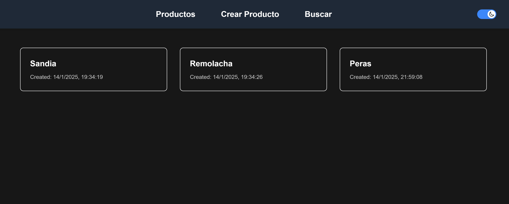

# Sample Database



This application is a complete solution built with Spring Boot for the backend and React + Next.js for the frontend, leveraging TypeScript for robust and type-safe development. The backend provides a REST API for managing products, including functionalities like adding, listing, and searching for products, with optimized queries powered by Redis. The frontend, designed with a responsive and mobile-friendly interface, consumes this API to display data in an intuitive list format, featuring a dark theme for improved user experience. Both services are integrated to ensure efficient data flow and a solid architecture suited for real-world scenarios. Code quality is maintained through linting for both frontend and backend services, with automated checks implemented via GitHub Actions. Additionally, Docker is used to containerize and run the services, ensuring seamless deployment and scalability.

## Tech stack

### Front End

- NextJS
- React
- TailwindCSS
- Typescript
- Axios
- NodeJS

## Frontend Structure

```
test_lottusse/
├── frontend/ # Frontend application
│ ├── src/
│ │ ├── app/ # Next.js pages and routes
│ │ ├── components/ # Reusable React components
│ │ ├── providers/ # Context providers
│ │ ├── lib/ # Utilities and helper functions
│ │ └── types/ # TypeScript type definitions
│ ├── public/ # Static files
│ ├── .next/ # Next.js build
│ ├── node_modules/ # Dependencies
│ ├── tailwind.config.ts # Tailwind CSS configuration
│ ├── next.config.js # Next.js configuration
│ ├── package.json # Dependencies and scripts
│ ├── tsconfig.json # TypeScript configuration
│ └── postcss.config.js # PostCSS configuration
```

# Setup

## Set Up Environment Variables

**Frontend:** Create a new file named `.env` in the folder frontend of your project and add the following content:

- Copy `frontend/.env.dist` to `frontend/.env`
- Replace the values with your own variables

### Runnig the Frontend

1. To install the dependencies execute

```sh
cd frontend
npm install
```

2. Run the project in developer mode

```sh
npm run dev
```
